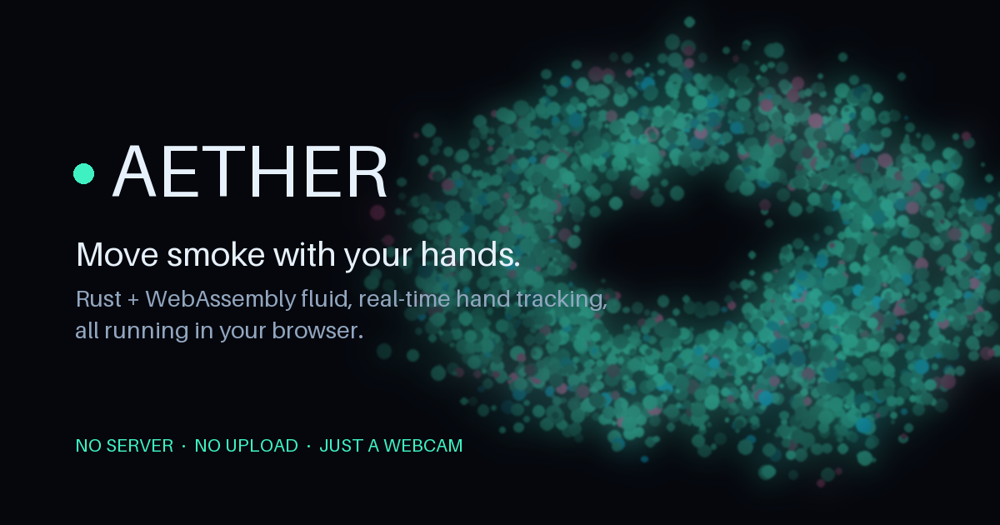

# Aether

[](https://github.com/NivBuskila/base44-rust-wasm-showcase/actions/workflows/ci.yml)
[](LICENSE)


[](https://aether-physics.xyz)

[](https://aether-physics.xyz)

A gesture-driven fluid reality engine. Stand in front of a webcam and move smoke
with your hands.

An incompressible Navier–Stokes solver and a particle system of 120,000 (up to
a million in overdrive), written in Rust and compiled to WebAssembly, driven in
real time by hand tracking, body pose and a body segmentation mask. Your
silhouette becomes a solid obstacle the fluid flows around. Your gestures are
spells: pinch to open a vortex, open your palm to push, close your fist to pull
everything in, point to paint fire, rotate both hands to warp time. Chain spells
into combos and cast with both hands for duets.

Everything runs locally in the browser. No server, no upload, no video leaving
the machine.

**Live demo: [aether-physics.xyz](https://aether-physics.xyz)** — open it in its own tab in a current Chrome, Edge
or Firefox and allow camera access.

## Why it is built this way

The interesting constraint is that this has a **33 ms budget end to end** —
capture, inference, simulation, render — and three of those four stages are
fighting for the same frame.

**The physics is in Rust, the perception is in the browser.** Neural inference
is already a solved, GPU-accelerated problem in the browser via MediaPipe; the
fluid solver is not, and it is the part that benefits from a real language with
real control over memory layout. So `aether-core` is a dependency-free Rust
crate holding the entire simulation, and the browser layer does capture,
inference and rendering.

**Two models, not five.** `GestureRecognizer` returns hand landmarks *and* a
canned gesture label from one inference. `PoseLandmarker` with
`outputSegmentationMasks` returns body joints *and* the silhouette from one
inference. Naively you would reach for four separate tasks — hands, gestures,
pose, segmentation — and spend the whole frame budget on inference.

**Inference is off the main thread.** MediaPipe runs in a module Web Worker fed
with `ImageBitmap`s, so a slow inference costs latency, never a dropped frame.
An inline fallback keeps the app working where the worker cannot start.

**Nothing is serialised per frame.** Camera luma goes *into* a Rust-owned buffer
and the dye texture and particle buffer come *out* of Rust-owned buffers, all as
typed-array views over WASM linear memory. The only per-frame copies are the two
the hardware forces: the camera readback and the texture upload.

**The engine does not depend on the models.** A dense multi-scale Horn–Schunck
optical flow solver runs over the camera's luma plane in Rust, so the fluid
reacts to whatever physically moves in front of the lens. If the models fail to
load, are blocked, or are simply too slow on the device, Aether still works — it
loses gestures, not responsiveness. With no camera at all it drives itself.

**Two renderers, one look.** A WebGL2 compositor runs everywhere; on a hardware
WebGPU adapter a second backend takes over and also *simulates* the particles in
a compute pass, replaying the engine's per-frame op log so both backends see the
same spells. The colour grading, bloom and sizing arithmetic are shared
TypeScript, so a look change is made once — only the shader packing is per
backend. `?gpu=off` / `?gpu=on` override the gate.

**The simulation is testable on the host.** `aether-core` compiles for x86 and
wasm32 from the same source with no `cfg` divergence in the algorithms, so the
fluid solver's incompressibility, the optical flow's sign and scale, and the
gesture state machine's hysteresis are all asserted by `cargo test` on the
machine that built it — not eyeballed through a canvas. `visual.rs` even scores
the dye field (saturation, filament contrast, swirl, coverage) so a tuning
change can be judged without a browser.

## Running it

### Quick start

You need three things installed:

| Tool | Version | Why |
| --- | --- | --- |
| [Rust](https://rustup.rs) | 1.90 (picked automatically from `rust-toolchain.toml`) | compiles the simulation to WebAssembly |
| `wasm-pack` | 0.13+ | packages the WASM as an ES module |
| [Node.js](https://nodejs.org) | 22 | runs the Vite dev server and the tooling |

Then, from a fresh clone:

```bash
# 1. One-time Rust setup
rustup target add wasm32-unknown-unknown
cargo install wasm-pack

# 2. Install the web tooling (also vendors the MediaPipe WASM runtime)
cd web
npm install

# 3. Optional: keep the ~14 MB of models locally so it works offline
npm run fetch:models

# 4. Build the engines and start the dev server
npm run dev
```

The first `npm run dev` compiles both WASM engines (about a minute with LTO);
later starts skip the build when the artefacts are already there. When Vite
prints its URL, open **http://localhost:5173** in a current Chrome, Edge or
Firefox and **allow camera access**.

What you should see:

- Smoke drifting on its own before you do anything — that is the ambient drive.
- The HUD in the corner showing fps and the engine line — `1 thr · simd` for
  the baseline, `N thr · simd` plus a *threads* badge when the multithreaded
  engine is running. Which renderer won is in
  `window.__aether.diagnostics().renderBackend` (`webgl2` or `webgpu`).
- The moment a hand is seen, the gesture tutorial opens by itself and walks you
  through each spell. Reopen it any time with `T` or the panel's book button;
  `H` or `?` shows the key reference.

Without a camera (or with permission denied) the app still runs: the fluid
drives itself and the HUD says why perception is off.

<details>
<summary>No local Rust or Node? Run it in Docker</summary>

```bash
docker compose -f docker-compose.base44.yml up -d --build
# then open http://localhost:3000
```

The first boot takes a few minutes while the toolchains download.
</details>

### Useful URL switches

| Query | Effect |
| --- | --- |
| `?engine=single` | force the single-threaded engine for side-by-side comparison |
| `?gpu=off` / `?gpu=on` | force the WebGL2 or the WebGPU renderer |
| `?rscale=0.5` | pin the internal render scale (WebGL2 path) |
| `?perception=off` | skip the models entirely — optical flow only |

### The multithreaded engine

`npm run dev` builds two engines from the same crate through
`scripts/build-wasm.sh release --if-missing --both`: the baseline
(single-threaded, SIMD128, into `web/src/wasm`) and a threaded one (the
`parallel` feature, into `web/src/wasm-mt`), where the fluid kernels and the
particle system run on a [rayon](https://github.com/rayon-rs/rayon) pool of Web
Workers over shared WASM linear memory. The engine picks the threaded build at
boot whenever the page is cross-origin isolated and falls back to the baseline
otherwise, so nothing breaks in an embedded frame or an old browser. The HUD
shows the tier and thread count either way.

The threaded build needs the nightly toolchain, because `std` itself has to be
recompiled with atomics. The script installs it on demand
(`rustup toolchain install nightly -c rust-src -t wasm32-unknown-unknown`) and
treats a failed threaded build as a warning, so a machine without it still gets
a working app.

Isolation is the part that usually bites. `SharedArrayBuffer` requires both
`Cross-Origin-Opener-Policy: same-origin` and `Cross-Origin-Embedder-Policy`,
and hosts or preview proxies routinely forward the first while dropping the
second — isolation then fails silently and the HUD stays on `1 thr`. Since
headers cannot be set from the page, `public/coi-serviceworker.js` re-attaches
both from a Service Worker and the app reloads once to pick them up. Inside an
iframe this is skipped: isolation is a property of the whole frame tree, so an
embedded page follows its host and runs single-threaded.

### Troubleshooting

| Symptom | Cause and fix |
| --- | --- |
| `npm install` fails with `Exit handler never called!` | A known npm bug, not this project. `npm cache clean --force` and retry; or `npm install --ignore-scripts` followed by `npm run sync:mp`. |
| HUD stays on `1 thr` | The page is not cross-origin isolated. Open it in its own tab (not an iframe) and hard-reload once so the Service Worker installs. If `web/src/wasm-mt/` is missing, the nightly toolchain was unavailable — run `scripts/build-wasm.sh release --threads` and read its warning. |
| Vite reports `Failed to resolve import "./wasm-mt/aether.js"` | The threaded build has not finished yet. It clears itself once `web/src/wasm-mt/` appears. |
| Perception says it stood down / gestures do nothing | Inference is too slow for the device (or the models were blocked). The fluid still follows your motion through optical flow; try a smaller window or `?gpu=on`. |
| Models load slowly on first run | Without `npm run fetch:models` they come from Google's CDN once; fetching them locally makes it work offline and start faster. |
| Black canvas, no smoke | Check the browser console for a WebGL2/WebGPU error and try `?gpu=off`. On a headless or software GPU expect a low frame rate — see *Measured*. |

### Gestures

| Gesture | Spell | Effect |
| --- | --- | --- |
| Open palm | repel | Pushes fluid and particles away |
| Closed fist | attract | Pulls everything into a gravity well |
| Open a held fist | release | A ring burst scaled by how long the fist was held |
| Pinch | vortex | Opens a vortex that winds up the longer you hold it |
| Point | ignite | Paints a hot dye trail from your fingertip |
| Victory | freeze | Freezes the fluid locally, cold palette |
| Thumb up | shatter | One-shot particle burst |
| Both hands, rotating | warp | Warps simulation time |

Moving your hand pushes fluid regardless of gesture, and your whole body is a
collision boundary, so waving an arm displaces smoke.

**Combos** are spells cast in sequence with one hand: *nova* (fist → palm),
*tempest* (palm → pinch), *supernova* (fist → victory → fist). **Duets** need
both hands: *tide* (fist + palm), *clap* (two open hands meeting fast), *big
bang* (two fists squeezed together, then both opened). The HUD's spellbook
tracks the progress of each sequence live.

The tutorial puts the engine in *practice mode*, which keeps single spells
casting but suppresses combos and duets, so a lesson never chains its poses
into a nova by accident.

### Quality at runtime

A performance governor watches the smoothed frame rate and steps quality down —
internal resolution first, then pressure iterations, then pool size — and back
up as headroom returns. Overdrive (`O`) jumps to the full million-particle pool
and shows a throughput strip. A set of parameter presets gives the nine sliders
starting points worth seeing. `window.__aether.diagnostics()` exposes the
engine tier, render backend, quality tier and perception state for debugging.

## Architecture

```
web/                              TypeScript, no framework
├── main.ts                       boot + the window.__aether test hooks
├── app.ts                        the App object and the frame loop
├── frame-clock.ts / frame-timings.ts
├── engine-loader.ts              picks threaded vs baseline wasm at boot
├── engine-views.ts               typed-array views over WASM memory
├── camera.ts                     getUserMedia + Rec. 709 luma downscale
├── perception.ts                 MediaPipe session: GestureRecognizer + PoseLandmarker
├── perception.worker.ts          the same, in a module worker
├── perception/                   graphs, duty-cycle limiter, result packing
├── render/                       WebGL2 compositor + the shared look/sizing maths
├── gpu/                          WebGPU renderer + particle compute (WGSL)
├── hud*.ts                       telemetry, controls, spellbook, presets
├── tutorial*.ts, hand-*.ts       the gesture tutorial and its hand drawings
├── performance-governor.ts       adaptive quality
├── qa-recorder.ts                evidence from a manual QA session
├── constants.ts                  mirror of the Rust layout, asserted at boot
└── styles/                       CSS, one file per concern

crates/aether-core/               zero dependencies, native + wasm32
├── field/                        Grid / VecField, bilinear sampling
├── fluid/                        Stable Fluids: advect, diffuse, project, SIMD kernels
├── flow/                         multi-scale Horn–Schunck optical flow
├── particles/                    SoA pool, RK2 advection, lanes, GPU offload op log
├── mask/                         segmentation mask -> obstacle + boundary velocity
├── gesture/                      landmark filtering, gesture state machine
├── spells/                       gestures -> forces, dye, bursts, duets
├── combo/, duet/                 sequences and two-hand casts
├── visual.rs                     scores the dye field for tuning without a browser
├── par.rs                        rayon or serial, same closures
└── engine/                       orchestration + the zero-copy buffer protocol

crates/aether-wasm/               wasm-bindgen glue, no logic
```

### The frame loop

Three clocks, deliberately decoupled — conflating them is what makes this class
of app stutter:

- **Render, ~60 Hz.** `engine.step(dt)` then draw. Never waits on anything.
- **Camera, ~30 Hz.** Luma readback for optical flow, and only when the video
  element has actually advanced.
- **Inference, adaptive.** Runs in the worker, one frame in flight at a time,
  so its cost never lands in a render frame. Where the worker is unavailable
  the inline fallback is synchronous, and its cadence is then derived from
  measured latency so it spends a bounded share of wall time. If inference
  cannot fit that share even at the maximum interval, it is too expensive for
  the device: perception stands down with a reason the user can act on, and
  the optical-flow path carries the app at full responsiveness. Between
  inferences the last known landmarks keep driving the simulation.

### Coordinate conventions

One convention, stated once, because mixing these up is the source of most bugs
in a pipeline like this:

- Inside `aether-core`, everything is **grid space**: a value lives at integer
  lattice point `(i, j)` and a `w × h` grid spans `[0, w-1] × [0, h-1]`.
  Sampling is bilinear and clamps at the border.
- Velocities are **grid cells per second**, never per frame. Every decay goes
  through `math::decay(rate, dt)`, so a 30 fps and a 144 fps session look
  identical.
- Normalised `[0, 1]` coordinates appear **only** at the engine boundary, where
  landmarks come in. Hand-relative distances (duets, bolts) are in hand widths.
- The user sees a **mirrored** camera view, so landmarks and the luma plane are
  mirrored to match. Otherwise moving your hand right would push the fluid left.

The fluid grid is 256 × 144 for a 16:9 frame, so cells are square in screen
space and no anisotropic correction is needed anywhere.

## Measured

Native release, on a 4-core container, from
`cargo test --release -p aether-core --test perf -- --nocapture`:

| stage | cost |
| --- | --- |
| fluid step (advect, diffuse, vorticity, project) | 9.0 ms |
| + 120k particles | 17.3 ms |
| + optical-flow drive | 18.6 ms |
| optical flow, per camera frame | 1.4 ms |
| one 60 fps frame, for reference | 16.7 ms |

These are single-threaded on the 256 × 144 grid. In the browser the baseline
engine step is about 28 ms with 120k particles, which is why the performance
governor exists; the threaded engine spreads the fluid kernels and the particle
lanes across cores, and on the WebGPU path the particles leave the CPU entirely.

Two numbers that are *not* the engine, recorded so they are not misread:

- **Headless frame rate is fill-rate bound on SwiftShader.** fps tracks pixel
  count almost exactly (922k px → 3.7 fps, 518k → 5.5, 230k → 8.8, 58k → 12.1)
  while turning off all 120k particles moves it only 3.7 → 4.8. That is a
  software rasteriser shading ~20 texture fetches per pixel across the bloom
  chain, which a GPU does in single-digit milliseconds. The suite therefore
  asserts on `stepMs` and on the loop not stalling, never on fps.
- **Headless inference is ~1200 ms per call.** MediaPipe's GPU delegate on
  SwiftShader is software. The app measures this and stands down rather than
  stalling — see the frame loop section.

## Testing

```bash
cargo test --workspace     # 229 tests: the simulation, on the host
cd web && npm run typecheck
cd web && npm run test:unit # 204 tests: the TypeScript that needs no browser (vitest)
cd web && npm run test:e2e  # 35 tests: the browser, headless, no webcam (Playwright)
```

The unit suite covers what used to be reachable only through a canvas: the
HUD's key map and telemetry cells, the frame clock, the tutorial's step logic,
the perception limiter, the performance governor, the shared look/sizing
arithmetic, the GPU/CPU op-log protocol, and every WGSL module — parsed with
`wgsl_reflect` so uniform sizes and binding layouts are pinned without a GPU.

The end-to-end suite runs the real app in headless Chromium with **no camera and
no GPU**:

- Chromium's fake capture device is fed a synthetic Y4M clip generated by
  `scripts/make-fixture-video.mjs` — a static textured background with one disc
  moving at a known velocity, so the optical flow path has ground truth to be
  asserted against rather than eyeballed.
- The gesture suite injects a scripted `PerceptionSource` through a test hook and
  drives the exact packed buffer layout the real perception module fills. That
  exercises the whole chain from landmarks to latched spells to pixels without
  needing a real hand in front of a real camera.
- WebGL2 runs on SwiftShader.

On a machine where Playwright's own browser download is unavailable, point it at
an existing Chromium with `AETHER_CHROMIUM=/path/to/chromium`.

CI (`.github/workflows/ci.yml`) runs `cargo fmt --check`, `cargo clippy
-D warnings`, `cargo test --workspace`, both WASM builds, the typecheck and the
unit suite on every pull request.

## Deploying

The site is fully static and ships to Cloudflare Pages from
`.github/workflows/deploy.yml` on every push to `main` (or by hand from the
Actions tab). The workflow builds both WASM engines itself — Cloudflare's own
build image cannot run the nightly threaded build — self-hosts the MediaPipe
runtime and models, and uploads `web/dist`.

One-time setup, in the GitHub repository settings:

| Setting | Kind | Value |
| --- | --- | --- |
| `CLOUDFLARE_API_TOKEN` | secret | an API token with *Cloudflare Pages: Edit* |
| `CLOUDFLARE_ACCOUNT_ID` | secret | from the Cloudflare dashboard sidebar |
| `CLOUDFLARE_PAGES_PROJECT` | variable, optional | Pages project name (default `aether`) |
| `SITE_URL` | variable, optional | public origin for link previews, e.g. a custom domain (default `https://aether-physics.xyz`) |

The first run creates the Pages project. `web/public/_headers` sends the COOP
and COEP headers, so production is cross-origin isolated and the multithreaded
engine starts without the Service Worker fallback. Pages caps a single file at
25 MB; the largest one today is about 12 MB.

## License

MIT
